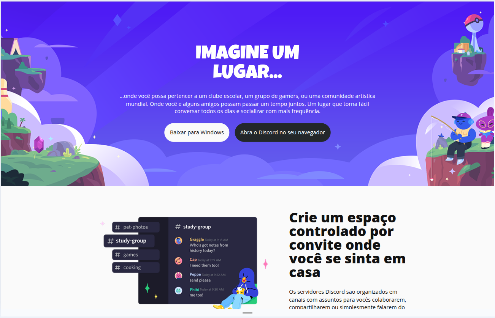
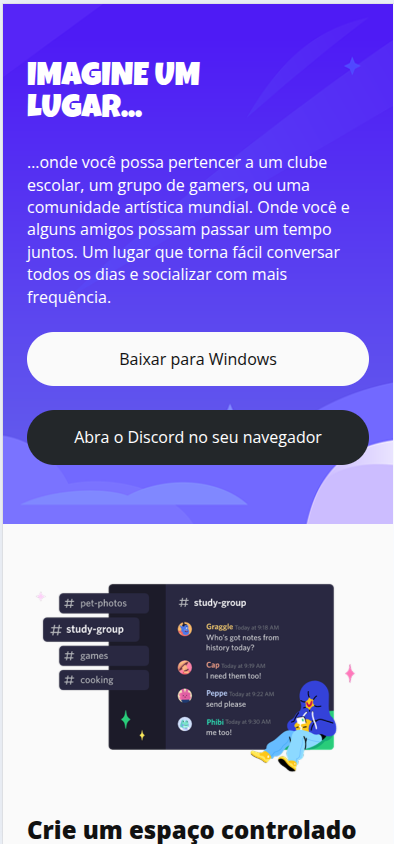

# Discord — Layout Responsivo

### Projeto Front-end | HTML e CSS

Projeto desenvolvido como desafio prático de **desenvolvimento responsivo com CSS**, com o objetivo de reproduzir uma landing page inspirada no site do Discord e aplicar conceitos de adaptação de interfaces para diferentes tamanhos de tela.

O projeto faz parte da minha jornada de estudos em desenvolvimento Front-end e foi utilizado para consolidar conhecimentos relacionados a **HTML, CSS, Responsive Web Design, Flexbox, CSS Grid e Media Queries**.

🌐 **[Ver projeto online](https://diegodemelo.github.io/trilha-css-desafio-layout-responsivo/)**

## Demonstração

### Desktop



### Mobile



---

## Sobre o projeto

O desafio consiste na construção de uma página inspirada na identidade visual do Discord.

A interface apresenta diferentes seções de conteúdo, imagens, chamadas para ação e um layout que se reorganiza de acordo com a largura disponível na tela.

O foco principal do projeto está na construção de uma experiência visual que funcione tanto em dispositivos menores quanto em telas maiores.

---

## Objetivos do projeto

Este projeto foi desenvolvido para praticar principalmente:

- construção de layouts responsivos;
- organização de conteúdo com HTML;
- estilização com CSS;
- utilização de Flexbox;
- utilização de CSS Grid;
- criação de Media Queries;
- adaptação de elementos para diferentes larguras de tela;
- utilização de variáveis CSS;
- organização de espaçamentos;
- tipografia responsiva;
- posicionamento de imagens;
- alteração da disposição dos elementos conforme o viewport.

---

## Tecnologias utilizadas

| Tecnologia | Aplicação |
|---|---|
| HTML5 | Estrutura e organização do conteúdo |
| CSS3 | Estilização e responsividade |
| Flexbox | Alinhamento e distribuição de elementos |
| CSS Grid | Estruturação das seções |
| Media Queries | Adaptação para diferentes tamanhos de tela |
| CSS Variables | Padronização de fontes, cores e espaçamentos |

---

## Estrutura do projeto

```text
trilha-css-desafio-layout-responsivo/
│
├── assets/
│   ├── css/
│   │   └── styles.css
│   │
│   └── img/
│       └── imagens utilizadas pela interface
│
└── index.html
```

O projeto foi desenvolvido utilizando apenas tecnologias nativas da Web, sem frameworks ou bibliotecas JavaScript.

---

## Estrutura da página

A página é organizada em diferentes áreas.

### Header

O cabeçalho contém:

- título principal;
- texto de apresentação;
- botão para download;
- botão para acesso pelo navegador;
- imagem de fundo adaptada ao tamanho da tela.

---

### Primeira seção

Apresenta conteúdo relacionado à criação de espaços e comunidades.

A seção combina:

- imagem;
- título;
- texto explicativo.

---

### Segunda seção

Apresenta outro bloco de conteúdo com disposição visual alternada em telas maiores.

Essa mudança ajuda a criar variação visual entre as seções da página.

---

### Terceira seção

Mantém a estrutura de imagem e conteúdo textual, explorando novamente a disposição responsiva.

---

### Seção final

Apresenta uma chamada relacionada à tecnologia de conexão do Discord, acompanhada de uma imagem em destaque.

---

### Footer

O rodapé utiliza fundo escuro e apresenta a identidade visual relacionada ao projeto.

---

## Responsividade

A estrutura base do projeto prioriza uma disposição vertical.

Em telas menores, os principais elementos são organizados em uma única coluna:

```text
Conteúdo
   ↓
Imagem
   ↓
Texto
   ↓
Próxima seção
```

Os botões do cabeçalho também ficam organizados verticalmente.

Para telas maiores, o layout passa por diferentes adaptações.

A partir do breakpoint definido no CSS:

```css
@media (min-width: 429px)
```

a estrutura é modificada para aproveitar melhor o espaço horizontal disponível.

---

## Layout em telas menores

Em dispositivos com menor largura:

- conteúdo em coluna única;
- botões ocupando a largura disponível;
- imagens responsivas;
- títulos adaptados;
- seções apresentadas verticalmente;
- espaçamentos adequados para leitura.

Exemplo conceitual:

```text
┌────────────────────────┐
│        TÍTULO          │
│                        │
│         Texto          │
│                        │
│       [ Botão ]        │
│       [ Botão ]        │
├────────────────────────┤
│                        │
│        Imagem          │
│                        │
│        Título          │
│         Texto          │
│                        │
└────────────────────────┘
```

---

## Layout em telas maiores

Em telas maiores, algumas seções passam a utilizar duas áreas principais:

```text
┌─────────────────────────────────────────┐
│                                         │
│       Imagem        │      Texto        │
│                     │                   │
└─────────────────────────────────────────┘
```

Em uma das seções, a disposição é invertida para criar alternância visual:

```text
┌─────────────────────────────────────────┐
│                                         │
│       Texto         │      Imagem       │
│                     │                   │
└─────────────────────────────────────────┘
```

Os botões do cabeçalho também passam de uma disposição vertical para horizontal.

---

## CSS Grid

O projeto utiliza CSS Grid para organizar diferentes partes da página.

Na versão base:

```css
grid-template-columns: 1fr;
```

Esse comportamento mantém os elementos em uma única coluna.

Em telas maiores, determinadas seções passam a utilizar:

```css
grid-template-columns: auto 1fr;
```

permitindo dividir a área entre imagem e conteúdo textual.

---

## Flexbox

Flexbox é utilizado em diferentes elementos da interface, principalmente para:

- alinhamento;
- centralização;
- distribuição de componentes;
- organização dos botões;
- posicionamento vertical do conteúdo.

Em telas menores, os botões são organizados em coluna.

Em telas maiores, passam para:

```css
flex-direction: row;
```

criando uma disposição horizontal.

---

## Variáveis CSS

O projeto utiliza propriedades customizadas no `:root` para centralizar valores reutilizados.

Entre elas estão variáveis relacionadas a:

- fontes;
- cores;
- espaçamentos;
- bordas.

Exemplo:

```css
:root {
  --font-Luckiest: Luckiest Guy, cursive;
  --font-OpenSans: Open Sans, sans-serif;

  --text: #111;
  --text-white: #fff;

  --bg: #fafafa;
  --surface: #23272a;

  --radius-1: 28px;
}
```

Essa abordagem facilita a reutilização e manutenção dos estilos.

---

## Tipografia

O projeto utiliza duas famílias tipográficas importadas por meio do Google Fonts:

```text
Luckiest Guy
Open Sans
```

A fonte **Luckiest Guy** é utilizada principalmente nos títulos de maior destaque.

A **Open Sans** é utilizada nos demais textos e elementos da interface.

---

## Imagens responsivas

As imagens utilizam:

```css
img {
  width: 100%;
  height: auto;
}
```

Isso permite que elas acompanhem a largura disponível sem perder suas proporções originais.

---

## Conceitos praticados

Durante o desenvolvimento deste projeto foram trabalhados conceitos como:

### Responsive Web Design

Criação de uma interface capaz de se reorganizar de acordo com diferentes larguras de tela.

### Media Queries

Aplicação de regras específicas conforme o tamanho do viewport.

### Flexbox

Controle de alinhamento, direção e distribuição dos elementos.

### CSS Grid

Organização das seções em uma ou mais colunas.

### CSS Variables

Centralização de valores utilizados repetidamente na folha de estilos.

### Box Model

Controle de:

- margens;
- paddings;
- dimensões;
- bordas.

### Tipografia

Uso de famílias tipográficas, pesos, tamanhos e alinhamentos diferentes conforme o contexto visual.

---

## Executando o projeto

Clone este repositório:

```bash
git clone https://github.com/diegodemelo/trilha-css-desafio-layout-responsivo.git
```

Entre no diretório:

```bash
cd trilha-css-desafio-layout-responsivo
```

Depois abra:

```text
index.html
```

diretamente no navegador.

Também é possível utilizar uma extensão como **Live Server** no Visual Studio Code para executar o projeto em um servidor local.

---

## Projeto educacional

Este projeto foi desenvolvido como parte da minha formação complementar na **DIO**, em um desafio voltado à construção de layouts responsivos utilizando CSS.

O objetivo principal foi transformar os conceitos estudados em uma implementação prática.

Por se tratar de um projeto educacional, a identidade visual e os conteúdos relacionados ao Discord são utilizados exclusivamente para fins de estudo e prática de desenvolvimento Front-end.

---

## Aprendizados

O desenvolvimento deste projeto contribuiu para consolidar conhecimentos em:

- HTML;
- CSS;
- desenvolvimento Front-end;
- responsividade;
- Mobile First;
- Media Queries;
- Flexbox;
- CSS Grid;
- variáveis CSS;
- organização visual;
- adaptação de interfaces;
- estruturação de páginas;
- versionamento com Git e GitHub.

---

## Possíveis evoluções

Como projeto de estudos, ele pode continuar recebendo melhorias, como:

- refinamento dos breakpoints;
- melhoria da acessibilidade;
- revisão dos textos alternativos das imagens;
- melhoria da semântica HTML;
- criação de novos estados de interação;
- otimização de imagens;
- aprimoramentos de responsividade;

---

## Status

**Projeto educacional concluído.**

O código permanece disponível como registro da evolução dos meus estudos em desenvolvimento Front-end e Responsive Web Design.

---

## Autor

**Diego de Melo**

Desenvolvedor Full Stack Júnior

**Stack:**  
JavaScript • TypeScript • React • Next.js • Node.js • PostgreSQL

**LinkedIn:** 
[Diego de Melo](https://www.linkedin.com/in/diegodemelodev)

**GitHub:** 
[@diegodemelo](https://github.com/diegodemelo)

---

### HTML • CSS • Responsive Web Design • Flexbox • CSS Grid
